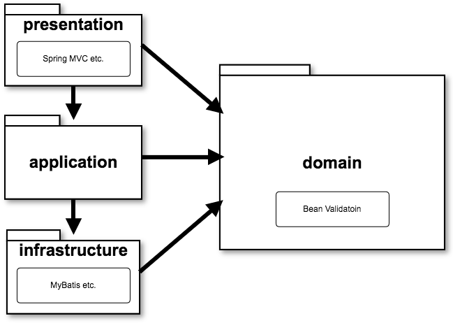

# ddd-base
gradle based Spring Boot &amp; MVC &amp; Thymeleaf &amp; Security &amp; MyBatis template project

## 起動方法

```sh
./gradlew clean ui:bootRun
```

## 実行可能Jarのビルド

```sh
./gradlew clean ui:build
```

## アーキテクチャ


